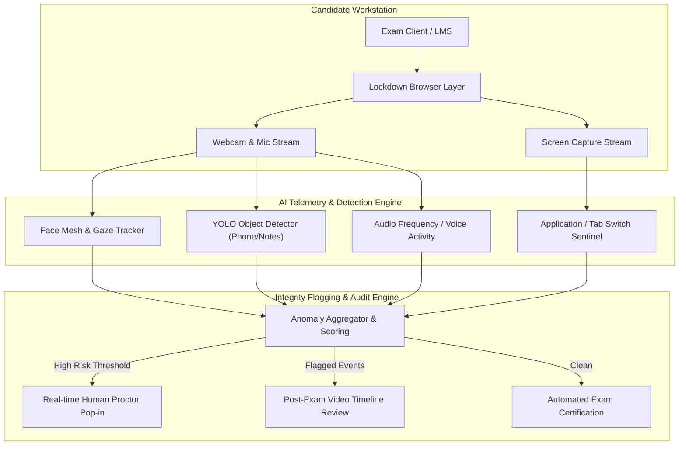

  

# Awesome Remote Proctoring 🛡️

  <b>A curated directory of SaaS platforms, automated AI invigilation engines, browser lockdown solutions, and open-source exam integrity projects.</b>

  
  
  
  
  
  
  

---

## 📖 Overview & Ecosystem Guide

Online exam proctoring (**remote invigilation**) encompasses technologies that safeguard academic and professional testing integrity in decentralized settings. These systems combine multi-modal candidate verification:

- 👁️ **Computer Vision & Gaze Tracking**: Real-time head pose estimation, facial recognition, eye-tracking, and object detection (e.g., secondary smartphones, unauthorized study notes).
- 🎙️ **Acoustic Environment Monitoring**: Background noise detection, whispering identification, and speech-to-text transcript anomaly flagging.
- 🔒 **Secure Browser Lockdown**: Kiosk-mode execution, multi-monitor blocking, process termination (preventing virtual machines, screen sharers, and debugging tools), and clipboard restriction.
- 🪪 **Biometric Identity Verification**: Government photo ID capture, 3D face liveness detection, continuous biometric re-authentication, and keystroke dynamics.
- 🤖 **AI vs. Human Hybrid Review**: Automated machine-learning event flagging paired with asynchronous auditor video review or on-demand live proctor intervention.

---

## 📑 Table of Contents

- [🌐 SaaS/Hosted Platforms](#-saashosted-platforms)
- [💻 Open-Source GitHub Projects](#-open-source-github-projects)
- [🏗️ Technical Architecture of Remote Proctoring](#️-technical-architecture-of-remote-proctoring)
- [⚖️ SaaS vs. Open-Source Decision Matrix](#️-saas-vs-open-source-decision-matrix)
- [🤝 How to Contribute](#-how-to-contribute)
- [📈 Star History](#-star-history)
- [⚠️ Disclaimer & Compliance](#️-disclaimer--compliance)

---

## 🌐 SaaS/Hosted Platforms 

> 📊 **Sector Market Size & Structure**: The global remote proctoring market is estimated at **$1.14B to $2.8B (2025–2026)** and projected to reach **$4.37B to $8.9B by 2033–2035**, expanding at a Compound Annual Growth Rate (**CAGR of ~13%–16%**). The sector is **highly concentrated at the top (oligopolistic / winner-take-most dynamics)**, with the top 4–5 established industry leaders (Meazure Learning/ProctorU, Examity, Respondus, and Proctorio) capturing >60% of total global assessment volumes, alongside a competitive layer of specialized enterprise HR and AI-native startups.

*Listed in descending order based on company scale (market cap, revenue, or private valuation).*

| Platform | Description | Company Scale (Revenue / Valuation) | Starting Pricing | Free Tier / Free Trial Limits |
| :--- | :--- | :--- | :--- | :--- |
| **[Mercer Mettl Proctoring](https://mettl.com/)** | Enterprise proctoring suite offering AI proctoring, live 3-point candidate authentication, Secure OS browser lockdown, and human invigilator review. | **Parent: Marsh McLennan (NYSE: MMC — ~$105B Market Cap)** • Mettl division: **~$40M–$50M ARR** (acquired for ~$40M in 2018) | Starts at **$2.00 – $4.00 / candidate** for automated AI proctoring (or ~$8.00 – $15.00 / candidate for live proctoring; enterprise platform commitments start at ~$1,000 – $2,000 / year; ₹150–₹350 / test in India). | **14-day trial account** with **up to 10 free candidate assessment test credits** and interactive system compatibility checks upon request via sales demo. |
| **[ProctorExam](https://proctorexam.com/)** | Dual-camera (smartphone 360° room view + webcam) remote proctoring infrastructure acquired by Turnitin, providing web-based monitoring without software installs. | **Parent: Turnitin / Advance Publications (Turnitin acquired for $1.75B)** • ProctorExam unit: **~$5M–$10M ARR** | Historical pricing started at **$4.00 – $7.00 / exam** for automated AI proctoring and **$15.00 – $30.00 / exam** for live invigilation (annual subscriptions started at ~$5,000 / year; currently maintained for existing Turnitin enterprise contracts). | **30-day institutional sandbox pilot** (up to 20 test sessions) for enterprise evaluation; no individual self-serve free tier. |
| **[ProctorU (Meazure Learning)](https://www.meazurelearning.com/)** | Industry-leading proctoring provider offering AI automated review (Review+) and 1-on-1 live human invigilation (Live+) for high-stakes certification and university exams. | **~$500M+ Valuation** (Backed by Gryphon Investors) • **~$120M–$150M ARR** (millions of high-stakes exams proctored annually) | Starts at **$15.00 – $17.50 / exam** (standard 60-min session; $25.00 for 120 min; automated Review+ starts at ~$8.00 – $10.00 / exam); institutional annual contracts start at ~$14,000 / year. | **30-day institutional pilot evaluation** (limited to 1 pilot course cohort or departmental test group) upon sales consultation. |
| **[Examity](https://www.examity.com/)** | Multi-tier proctoring solution offering automated AI monitoring, human video auditing, and real-time live proctors for higher education and corporate testing. | **~$150M–$200M Valuation** (Acquired by Meazure Learning; $90M Great Hill Partners investment) • **~$30M–$45M ARR** | Starts at **$10.00 – $14.00 / exam** for automated AI proctoring with audit; Live Proctoring starts at **$20.00 – $25.00 / exam** (student-pay options range $15.00 – $30.00 / exam). | **30-day institutional pilot program** (covering up to 50–100 trial exam sessions for a selected department/course) arranged via institutional consultation. |
| **[Proctorio](https://proctorio.com/)** | Automated AI-driven proctoring software with facial detection, gaze tracking, browser locking, room checks, and comprehensive LMS integration. | **~$200M–$300M Est. Valuation** (Profitable & bootstrapped) • **~$35M–$50M ARR** (over 30M exam sessions monitored) | Starts at **$5.00 – $10.00 / exam** (pay-as-you-go) or **$20.00 / student / course** (unlimited exams); annual campus licenses start at ~$5.00 – $15.00 / FTE student/year. | **30 to 60-day institutional pilot** (1–2 months) for up to 10–15% of the student body or select test courses upon institutional request. |
| **[Respondus Monitor](https://web.respondus.com/)** | Automated AI proctoring system that pairs with Respondus LockDown Browser to record webcam/audio and generate automated suspicion flags. | **~$150M–$200M Est. Valuation** (Longstanding market leader across thousands of universities) • **~$25M–$40M ARR** | Starts at **$4,950 / year** (first-year flat-rate campus-wide license); subsequent terms tiered starting at **$5,950 / year for 1,000 seats** ($1,950 per additional 1,000 seats; student-purchase option at $10.00 – $15.00 / seat). | **200 free seats included permanently** with an institution's Respondus LockDown Browser campus license; standalone **14-day free trial** for educators. |
| **[Honorlock](https://honorlock.com/)** | Hybrid remote proctoring combining automated AI monitoring with on-demand live proctor intervention and proprietary secondary device detection. | **~$150M–$200M Valuation** ($40M+ Series A/B funding from PeakSpan and Defiance) • **~$20M–$30M ARR** | Starts at **$4.45 – $8.24 / exam** (or **$14.50 – $25.00 / student / course** for unlimited exams); annual campus-wide licenses scale by FTE enrollment. | **30 to 60-day institutional pilot** (or 1 full academic semester pilot for 2–3 selected courses) upon sales qualification. |
| **[Inspera Proctoring](https://inspera.com/)** | European digital assessment ecosystem featuring automated screen/audio/video recording, Inspera Assessment integrity browser, and live invigilation. | **~$120M–$180M Valuation** (Backed by private equity firm IK Partners / CGE Partners) • **~$25M–$35M ARR** | Base site license starts at **$8,000 – $15,000 / year** (tiered by student volume band, approximately **$6.00 – $12.00 / active student / year**; remote proctoring module adds ~30% or ~$3.00 – $5.00 / exam attempt). | **30-day institutional pilot evaluation** (limited to 1 trial exam cohort or department with sandbox test environment) upon demo qualification. |
| **[Talview](https://www.talview.com/)** | AI proctoring (Alvy) and assessment platform providing automated lockdown, 360° audio-video monitoring, and candidate evaluation workflows. | **~$60M–$80M Valuation** ($20M+ Series A/B VC funding from Storm Ventures and Inventus) • **~$10M–$15M ARR** | Starts at **$350.00 / month** (billed annually at ~$4,200 / year for entry recruitment tier) or **$4.00 – $6.00 / candidate assessment**; enterprise campus suites start at ~$25,000 / year. | **14-day free pilot trial** (with up to 10 candidate assessment credits and candidate practice test mode) provided upon sales demo registration. |
| **[Proctortrack](https://proctortrack.com/)** | Multi-modal automated, hybrid, and live proctoring platform with ProctorLock browser lockdown, ProctorAuto AI flags, and mobile room scanning. | **~$30M–$50M Valuation** (Verificient Technologies) • **~$8M–$12M ARR** | Starts at **$2.25 – $5.00 / test** at higher enterprise volumes (and **$10.00 – $22.50 / test** for smaller institutional volumes); ProctorLock starts at ~$2.25 / test. | **30-day institutional pilot** (covering 1 trial course or up to 25 test attempts) upon sales onboarding. |
| **[SMOWL](https://smowl.net/)** | Continuous AI biometric monitoring platform verifying candidate identity, detecting secondary devices, and tracking browser activity. | **~$15M–$25M Valuation** (Smowltech S.L. / European EdTech) • **~$3M–$6M ARR** | Starts at **$3.00 – $5.00 / exam** (activity-based license) or **$15.00 – $25.00 / student / year** (user-based subscription for continuous multi-exam monitoring). | **Free demo with 25 complimentary proctoring licenses** (valid for up to 30 days of testing and LMS integration evaluation). |
| **[AutoProctor](https://autoproctor.co/)** | Automated AI proctoring SaaS and browser extension for Google Forms, Microsoft Forms, and quizzes with audio, video, and tab-switch monitoring. | **~$3M–$5M Valuation** (Bootstrapped EdTech SaaS) • **~$500K–$1.5M ARR** | Starts at **$15.00 / month** (includes 50 test attempts; additional attempts at ~$0.30 / attempt; pay-as-you-go bundles start at $10.00 for 25 tests). | **Free trial with 10 free test credits/attempts** upon account sign-up (credits do not expire, no credit card required). |

---

## 💻 Open-Source GitHub Projects 

Open-source proctoring projects provide foundational codebases, experimental prototypes, and customizable building blocks for academic research and internal testing.

*Listed in descending order by GitHub stargazer count.*

1. **[Proctoring-AI](https://github.com/vardanagarwal/Proctoring-AI)**   
   Automatic monitoring system for online proctoring utilizing computer vision (OpenCV, Dlib) to track eye gaze, detect facial absence/multiple faces, monitor mouth movement, and spot mobile phones with YOLO.

2. **[Safe Exam Browser (SEB)](https://github.com/SafeExamBrowser/seb-win-refactoring)**   
   Gold standard open-source web browser environment for secure assessments. Turns any computer into a secure workstation by regulating access to utilities, websites, shortcuts, and applications.

3. **[CBIT-AiExam-plus](https://github.com/reneverland/CBIT-AiExam-plus)**   
   AI-powered examination platform for institutions and enterprises with multi-disciplinary item generation, semantic scoring, security lockdown, and automated proctoring analytics.

4. **[MyProctor.ai](https://github.com/narender-rk10/MyProctor.ai-AI-BASED-SMART-ONLINE-EXAMINATION-PROCTORING-SYSYTEM)**   
   Full-stack smart examination proctoring web application built with Python Flask, MySQL, and YOLOv4 for automated video invigilation and cheating detection.

5. **[Amazon Rekognition Virtual Proctor](https://github.com/aws-samples/amazon-rekognition-virtual-proctor)**   
   AWS architecture reference sample showing how to assist with remote proctoring by streaming webcam frames into Amazon Rekognition to detect person count and face anomalies.

6. **[Aankh](https://github.com/tusharnankani/Aankh)**   
   Real-time computer vision proctoring tool monitoring candidate video streams for head turns, missing face, multi-person intrusions, and audio disturbances.

7. **[Hacklympics](https://github.com/aesophor/hacklympics)**   
   Online programming examination prototype featuring built-in anti-cheat mechanisms including keystroke dynamics logging, code-diff playback, and focus tracking.

8. **[edx-proctoring](https://github.com/openedx/edx-proctoring)**   
   Open edX proctoring backend service supporting integrations with external commercial and open proctoring providers for timed, verified MOOC exams.

9. **[ExamPro](https://github.com/lebmatter/exampro)**   
   Proctored assessment engine built on the Frappe framework, featuring candidate image snapshots, tab-switching restrictions, and test management dashboards.

10. **[Artificial Intelligence Online Exam Proctoring](https://github.com/krishnakumaragrawal/Artificial-Intelligence-based-Online-Exam-Proctoring-System)**   
    Python and computer-vision-based project executing facial recognition, eye tracking, lip-sync/whisper checking, and continuous activity log generation.

11. **[Exam Cheating Detection](https://github.com/AarambhDevHub/exam-cheating-detection)**   
    Real-time exam monitor that flags eye gaze drift, multi-face presence, and candidate talking using computer vision with instructor alert dashboards.

12. **[ITMOproctor](https://github.com/meefik/ITMOproctor)**   
    Distant supervision and proctoring system developed for university remote assessments with WebRTC live stream dispatch and proctor consoles.

13. **[Proctored MCQ Exam Platform](https://github.com/vincenzo-afk/Proctored-MCQ-Exam-Platform)**   
    Browser-based multiple-choice test portal equipped with automated camera proctoring, module timed progression, and completion certificate generation.

14. **[Intelligent Online Exam Proctoring](https://github.com/AparGarg99/Intelligent-Online-Exam-Proctoring-System)**   
    System providing student ID card verification, candidate distance-to-screen estimation, and face authentication for abnormal behavior monitoring.

15. **[GodsEye](https://github.com/AgnellusX1/GodsEye)**   
    Web-based smart virtual exam portal developed with React.js and machine learning models for detecting suspicious candidate conduct during tests.

16. **[ExamSecure](https://github.com/rajrajhans/examsecure)**   
    Academic remote examination platform featuring browser lock, face recognition, multi-person warnings, and candidate impersonation detection via webcam.

17. **[OpenProctor](https://github.com/kamlendras/OpenProctor)**   
    Modern Next.js open-source proctoring software providing a customizable real-time monitoring dashboard and assessment environment.

18. **[Exam Proctoring Video Analytics](https://github.com/SamratSengupta/exam-proctoring-video-analytics)**   
    Computer-vision virtual proctoring software analyzing facial landmarks, head pose orientation, and eye gaze using deep learning CNN models.

---

## 🏗️ Technical Architecture of Remote Proctoring

---

## ⚖️ SaaS vs. Open-Source Decision Matrix

| Dimension | Commercial SaaS (Proctorio, Honorlock, Mettl, etc.) | Open-Source Systems (SEB, Proctoring-AI, etc.) |
| :--- | :--- | :--- |
| **Primary Use-Case** | High-stakes university finals, certifications, corporate hiring | University research, internal quizzes, low-stakes practice |
| **Legal & Privacy Defensibility** | High (FERPA, GDPR, SOC 2 Type II compliant agreements) | Organization assumes full legal and data protection liability |
| **Human Proctor Network** | Available on-demand 24/7 (trained human invigilators) | Requires institution to staff its own proctors |
| **False-Positive Mitigation** | Machine learning models tuned across millions of sessions | High risk of false positives from off-the-shelf CV models |
| **Integration Complexity** | Turnkey LTI 1.3 plugins for Canvas, Blackboard, Moodle | Requires custom development, hosting, and API wiring |
| **Total Cost of Ownership** | Predictable per-exam ($2–$15) or annual seat licensing | Low software cost; high engineering, maintenance & GPU cost |

---

## 🤝 How to Contribute

We welcome contributions from developers, researchers, and EdTech practitioners!

1. 🍴 Fork the repository.
2. 🌿 Create a feature branch: `git checkout -b feature/new-proctoring-tool`
3. 📝 Add your entry ensuring:
   - **For SaaS**: Complete starting price and free tier/pilot limits.
   - **For Open-Source**: Repository link with social Stars_Badge pointing to stargazers.
4. 🚀 Submit a Pull Request with a clear description of the project.

---

## 📈 Star History

---

## ⚠️ Disclaimer & Compliance

- **Community-Curated**: This list is independently curated for educational and informational purposes; inclusion does not constitute endorsement.
- **Biometric & Privacy Laws**: Remote proctoring software captures sensitive biometrics (facial geometry, eye gaze, voiceprints) and video feeds. Implementations must comply with applicable regulations (e.g., GDPR, FERPA, Illinois BIPA). Always involve institutional legal, privacy, and accessibility teams before deploying proctoring software.

---

  <b>Built for universities, certification providers, and online assessment teams who demand exam integrity.</b>

